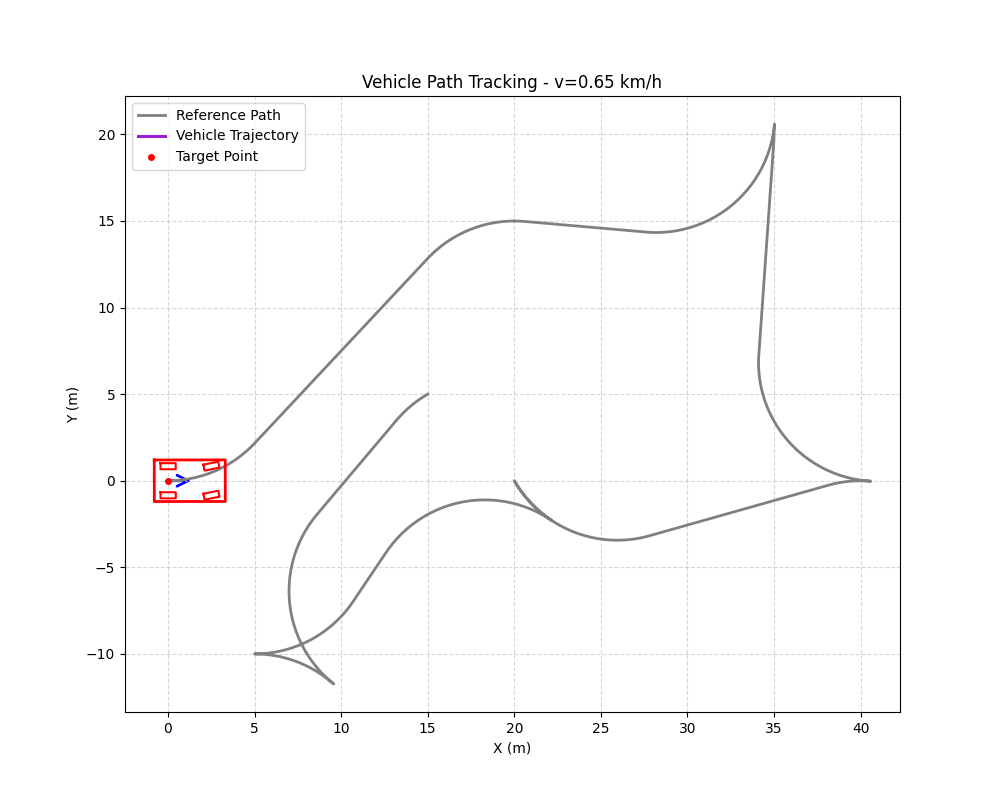

# Rear Wheel Feedback 控制器

## 算法简介

后轮反馈控制器（Rear Wheel Feedback Controller）是一种基于车辆后轴位置进行路径跟踪的控制算法。该算法通过后轴中心的横向误差、航向误差以及路径曲率进行反馈控制，特别适用于低速场景如泊车和狭窄空间导航[@Henry2020KongZhiSuanFaHouLunWeiZhiFanKui;@WeiDingYi2023LuJingGenZongHouLunWuChaiFanKuiGenZongSuanFaGeRenZongJie]。

## 控制原理

### 核心思想

后轮反馈控制器通过三个反馈项来计算车辆的横摆角速度：

1. **曲率前馈项**：根据参考路径的曲率进行前馈控制
2. **航向误差反馈项**：消除车辆航向与路径切线方向的偏差
3. **横向误差反馈项**：消除车辆后轴中心到参考路径的横向距离

### 几何原理图


如图所示，后轮反馈控制器的关键要素包括：

- **后轴中心 R**：控制参考点
- **横向误差 $e_d$**：后轴中心到参考路径最近点 P 的距离
- **航向误差 $e_\phi$**：车辆航向 $\psi$ 与路径切线 $\psi_{ref}$ 的夹角
- **路径曲率 $\kappa$**：参考路径在最近点处的曲率，用于前馈控制

### 控制律

后轮反馈控制器的横摆角速度计算公式为：

$$
\dot{\psi} = \frac{v_r \cdot \kappa \cdot \cos(e_\phi)}{1 - \kappa \cdot e_d} - K_\theta \cdot |v_r| \cdot e_\phi - K_e \cdot v_r \cdot \frac{\sin(e_\phi)}{e_\phi} \cdot e_d
$$

然后通过横摆角速度计算前轮转向角：

$$
\delta = \arctan\left(\frac{L \cdot \dot{\psi}}{v_r}\right)
$$

其中：

- $\dot{\psi}$ : 横摆角速度
- $v_r$ : 车辆速度
- $\kappa$ : 参考路径在最近点的曲率
- $e_\phi$ : 航向误差
- $e_d$ : 横向误差
- $K_\theta$ : 航向误差增益系数
- $K_e$ : 横向误差增益系数
- $L$ : 车辆轴距 (WB)


## 代码实现

### 核心代码

完整的 `ComputeControlCommand` 方法实现：

[:material-file-code: 查看源代码](https://github.com/yangtzech/MotionPlanning/blob/master/src/pyauto/control/Rear_Wheel_Feedback.py#L18-L56){ .md-button }

```python
--8<-- "src/pyauto/control/Rear_Wheel_Feedback.py:compute_control_command"
```

### 实现细节

#### 1. 误差计算

基于后轴中心计算横向误差和航向误差：

```python
--8<-- "src/pyauto/control/Rear_Wheel_Feedback.py:error_calculation"
```

#### 2. 除零保护

当航向误差接近零时，控制律中的 $\sin(e_\phi)/e_\phi$ 项会产生数值问题：

```python
--8<-- "src/pyauto/control/Rear_Wheel_Feedback.py:zero_protection"
```

#### 3. 控制律计算

结合曲率前馈和误差反馈计算转向角：

```python
--8<-- "src/pyauto/control/Rear_Wheel_Feedback.py:control_law"
```

## 参数配置

### 配置类定义

```python
--8<-- "src/pyauto/config/config.py:rear_wheel_feedback_config"
```

### 参数说明

| 参数        | 说明             | 影响             |
| ----------- | ---------------- | ---------------- |
| `K_theta` | 航向误差增益系数 | 越大航向收敛越快 |
| `K_e`     | 横向误差增益系数 | 越大横向收敛越快 |

## 优缺点分析

### 优点

1. **曲率前馈**：利用路径曲率信息，减小弯道处的跟踪误差
2. **低速稳定**：特别适合低速场景，如泊车和窄窄空间

### 缺点

1. **需要曲率信息**：依赖路径曲率，需要预先计算

## 使用示例

### 基本用法

```python
from pyauto.config.config import Config
from pyauto.control.Rear_Wheel_Feedback import RearWheelFeedbackController
from pyauto.control.pid_speed_control import PIDSpeedController

# 1. 创建配置
config = Config()
config.rear_wheel_feedback.K_theta = 1.0
config.rear_wheel_feedback.K_e = 0.5

# 2. 创建控制器
lat_controller = RearWheelFeedbackController(config)
lon_controller = PIDSpeedController(config)

# 3. 在控制循环中使用
for step in range(max_steps):
    cmd = lat_controller.ComputeControlCommand(current_node, reference_path)
    steering = cmd.steer
    vehicle.update(acceleration, steering)
```

### 使用工厂模式创建

```python
from pyauto.control.controller_factory import ControllerFactory
from pyauto.config.config import Config

config = Config()
config.rear_wheel_feedback.K_theta = 1.0
config.rear_wheel_feedback.K_e = 0.5

# 通过工厂创建控制器
controller = ControllerFactory.create("rear_wheel_feedback", config)
```

## 常见问题

### Q1: 为什么需要处理航向误差为零的情况？

**答**：控制律中包含 $\sin(e_\phi)/e_\phi$ 项，当 $e_\phi \to 0$ 时，该项趋近于 1（洛必达法则），但直接计算会产生除零错误。通过设置最小阈值避免此问题。

### Q2: K_theta 和 K_e 如何调节？

**答**：

- **K_theta 过大**：航向收敛快但可能震荡
- **K_theta 过小**：航向收敛慢，弯道跟踪差
- **K_e 过大**：横向误差消除快但可能过冲
- **K_e 过小**：横向误差消除慢

建议从默认值开始，根据实际表现进行微调。

### Q3: 后轮反馈与 Pure Pursuit 有什么区别？

**答**：

| 特性     | 后轮反馈       | Pure Pursuit |
| -------- | -------------- | ------------ |
| 参考点   | 后轴中心最近点 | 前视点       |
| 曲率信息 | 需要           | 不需要       |
| 参数     | K_theta, K_e   | Ld, kf       |


## 仿真演示

下图展示了 RearWheelFeedback控制器的实际运行效果：



## 参考文献